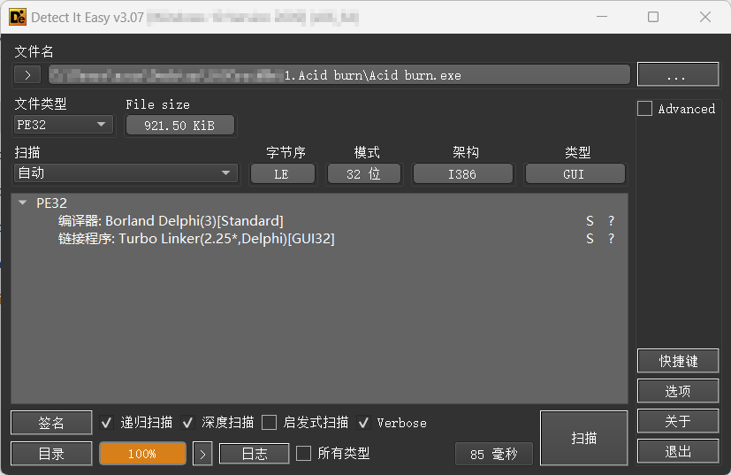
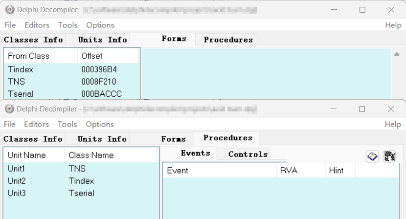
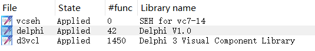
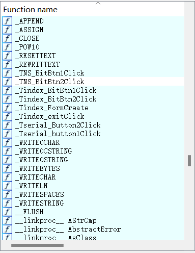
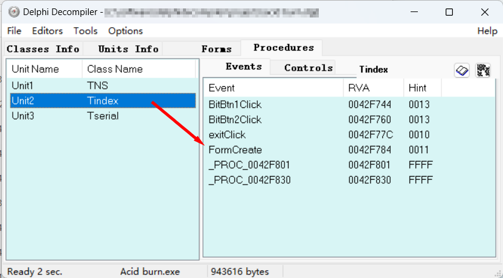
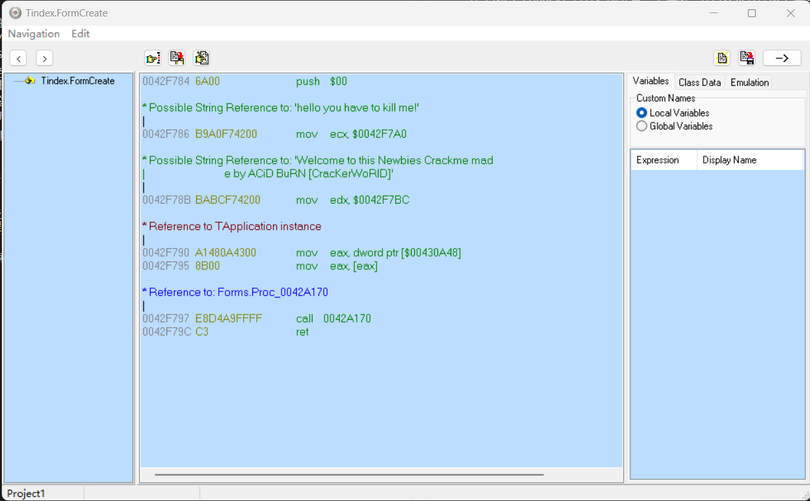
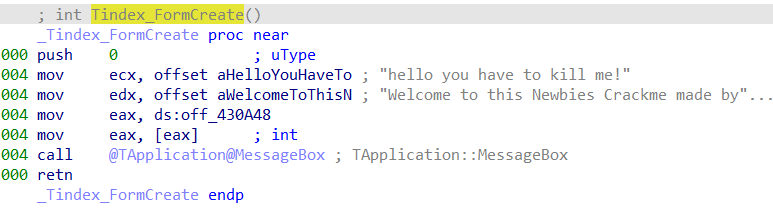
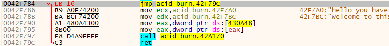
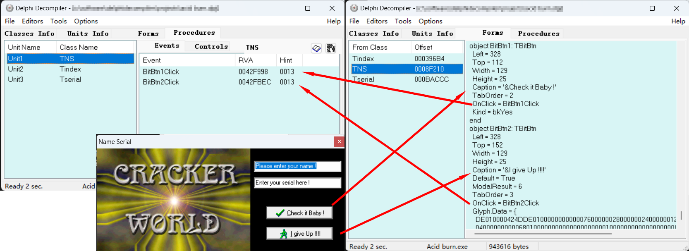
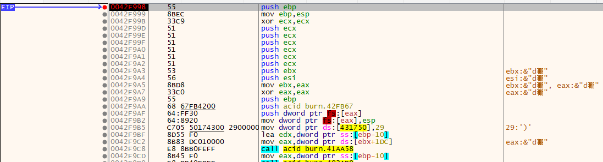

# 001 - Acid burn

## 分析

  
先对 Acid burn.exe 进行查壳（这里使用 Detect It Easy）。  
可以看到此程序使用 Delphi 3 写的，并且没有加壳，所以我们可以直接把这个程序拖到 Delphi Decompiler 中去。  
  
在 Delphi Decompiler 中可以看到有三个窗口，分别对应着三个过程。  
|  窗口   | 描述             |
| :-----: | ---------------- |
| Tindex  | 主窗口           |
|   TNS   | Name/Serial 窗口 |
| Tserial | Serial 窗口      |

  
在 IDA 中打开，然后点击 **View**->**Open subviews**->**Signatures**，并导入 delphi 和 d3vcl 两个签名。  
可以看到 IDA 正确的解析了 Delphi 程序的函数名。  


## 去掉 NAG 窗口

在主窗口（Tindex）打开之前会有一个弹窗，并且要求去掉这个弹窗，所以可以在 Tindex 的过程里分析。  
  
可以看到在 Tindex 过程中有一个 FormCreate 事件，这个是窗口创建时要进行的操作。  
  
通过注释不难看出这是窗口弹出的关键事件。  
所以可以复制这个事件的 RVA 到 IDA 中去来分析这个代码。  
  
通过打开 **Options**->**General**->**Disassembly**->**Display disassembly line path**->**Stack Pointer** 可以清楚的看到栈指针的位置。  
为了保持栈的平衡，所以要在栈指针相同的地方来进行补丁.  
  
在 x32dbg 中将 push 0 这句改为 jmp 0x42F79C 并保存为 Acid burn - no nag.exe 即可。

## Name/Serial 分析过程

  
在 Delphi Decompiler 中打开 TNS 过程可以看到有两个事件。  
|   事件名称   | 描述          |
| :----------: | ------------- |
| BitBtn1Click | 按钮1单击事件 |
| BitBtn2Click | 按钮2单击事件 |

从图中不难看出，BitBtn1Click 是 “Check it Baby !”的单击事件，所以要着重对 BitBtn1Click 函数进行分析。  

  
使用 x32dbg 打开 Acid burn.exe 之后，在 0042F998 处设置断点后按 F9 运行。点击“Serial / Name”后输入假码并点击“Check it Baby !”，程序在 0042F998 处断下。  
分析可得，关键代码如下（call xxxx 已被替换为有意义的函数名）  

```asm
; 获取 Edit1 (name) 内容的指针到dest
lea edx,dword ptr ss:[dest]
mov eax,dword ptr ds:[ebx+1DC]
call <acid burn.TControl::GetText>
```

```asm
; 获取 Edit2 (serial) 内容的指针到dest
lea edx,dword ptr ss:[dest]
mov eax,dword ptr ds:[ebx+1E0]
call <acid burn.TControl::GetText>
```

```asm
0042F9BF | lea edx,dword ptr ss:[ebp-10]      |
0042F9C2 | mov eax,dword ptr ds:[ebx+1DC]     |
0042F9C8 | call <acid burn.TControl::GetText> |
0042F9CD | mov eax,dword ptr ss:[ebp-10]      |
0042F9D0 | call <acid burn.LStrToPChar>       |
0042F9D5 | mov dword ptr ds:[43176C],eax      | 把 name 存到 43176C
-----------------------------------------------
0042FA4D | mov eax,dword ptr ds:[43176C]      |
0042FA52 | call <acid burn.StrLen>            | 计算 name 字符数
0042FA57 | cmp eax,4                          | 第一个关键跳转
0042FA5A | jge acid burn.42FA79               | name 长度小于4则失败
```

```asm
0042F9B5 | mov dword ptr ds:[431750],29       |
-----------------------------------------------
0042FA79 | lea edx,dword ptr ss:[ebp-10]      |
0042FA7C | mov eax,dword ptr ds:[ebx+1DC]     |
0042FA82 | call <acid burn.TControl::GetText> |
0042FA87 | mov eax,dword ptr ss:[ebp-10]      |
0042FA8A | movzx eax,byte ptr ds:[eax]        | 获取 name 第一个字符
0042FA8D | imul dword ptr ds:[431750]         | 乘 0x29
0042FA93 | mov dword ptr ds:[431750],eax      |
0042FA98 | mov eax,dword ptr ds:[431750]      |
0042FA9D | add dword ptr ds:[431750],eax      | 扩大两倍
0042FAA3 | lea eax,dword ptr ss:[ebp-4]       |
0042FAA6 | mov edx,acid burn.42FBAC           | 42FBAC:"CW"
0042FAAB | call <acid burn.LStrLAsg>          |
0042FAB0 | lea eax,dword ptr ss:[ebp-8]       |
0042FAB3 | mov edx,acid burn.42FBB8           | 42FBB8:"CRACKED"
0042FAB8 | call <acid burn.LStrLAsg>          |
0042FABD | push dword ptr ss:[ebp-4]          |
0042FAC0 | push acid burn.42FBC8              | 42FBC8:"-"
0042FAC5 | lea edx,dword ptr ss:[ebp-18]      |
0042FAC8 | mov eax,dword ptr ds:[431750]      |
0042FACD | call <acid burn.IntToStr>          | 将上面的结果转换为字符串
0042FAD2 | push dword ptr ss:[ebp-18]         |
0042FAD5 | push acid burn.42FBC8              | 42FBC8:"-"
0042FADA | push dword ptr ss:[ebp-8]          |
0042FADD | lea eax,dword ptr ss:[ebp-C]       |
0042FAE0 | mov edx,5                          |
0042FAE5 | call <acid burn.LStrCatN>          | 拼接 "CW"+"-"+name+"-"+"CRACKED"
0042FAEA | lea edx,dword ptr ss:[ebp-10]      | 示例 "CW-1234-CRACKED"
0042FAED | mov eax,dword ptr ds:[ebx+1E0]     |
0042FAF3 | call <acid burn.TControl::GetText> |
0042FAF8 | mov edx,dword ptr ss:[ebp-10]      |
0042FAFB | mov eax,dword ptr ss:[ebp-C]       |
0042FAFE | call <acid burn.LStrCmp>           | 把真码和 serial 比较
0042FB03 | jne acid burn.42FB1F               | 第二个关键跳转，serial 和真码相同时成功
```

注册机代码如下  

```cpp
#include <cinttypes>
#include <cstdint>
#include <cstdio>
#include <cstring>

int main() {
    constexpr std::uint32_t num = 0x29 * 2;
    char name[256];
    std::puts("Enter name:");
    std::scanf("%255s", name);
    if (std::strlen(name) < 4) {
        std::fputs("Wrong name.\n", stderr);
        return 0;
    }
    std::printf("Serial: CW-%" PRIu32 "-CRACKED\n",
                static_cast<std::uint32_t>(*name) * num);
    return 0;
}
```

## Serial 分析过程

Serial 的分析过程相对简单，关键代码只有一处。  

```asm
0042F48A | lea eax,dword ptr ss:[ebp-4]       |
0042F48D | mov edx,acid burn.42F540           | 42F540:"Hello"
0042F492 | call <acid burn.LStrLAsg>          |
0042F497 | lea eax,dword ptr ss:[ebp-8]       |
0042F49A | mov edx,acid burn.42F550           | 42F550:"Dude!"
0042F49F | call <acid burn.LStrLAsg>          |
0042F4A4 | push dword ptr ss:[ebp-4]          |
0042F4A7 | push acid burn.42F560              | 42F560:" "
0042F4AC | push dword ptr ss:[ebp-8]          |
0042F4AF | lea eax,dword ptr ss:[ebp-C]       |
0042F4B2 | mov edx,3                          |
0042F4B7 | call <acid burn.LStrCatN>          | 拼接字符串
0042F4BC | lea edx,dword ptr ss:[ebp-10]      | "Hello "+" "+"Dude!"
0042F4BF | mov eax,dword ptr ds:[ebx+1E0]     |
0042F4C5 | call <acid burn.TControl::GetText> |
0042F4CA | mov eax,dword ptr ss:[ebp-10]      |
0042F4CD | mov edx,dword ptr ss:[ebp-C]       |
0042F4D0 | call <acid burn.LStrCmp>           | 真码和 serial 比较
0042F4D5 | jne acid burn.42F4F1               |
```

所以真码为  

```text
Hello Dude!
```
