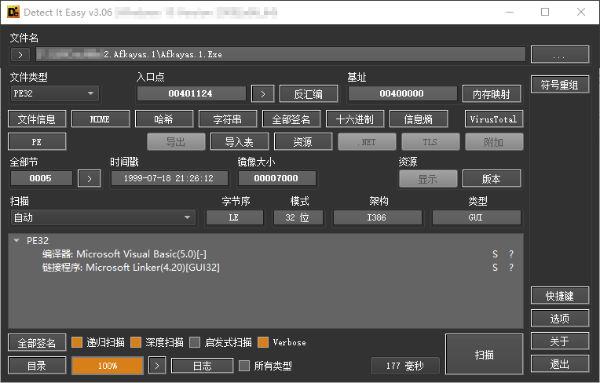
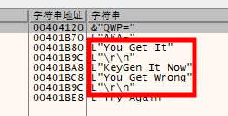

# 002 - AfKayAs.1

## 分析

  
对 Afkayas.1.Exe 查壳可以看出是 VB 编写，无壳程序。

## 注册分析

用 x32dbg 打开 Afkayas.1.Exe 运行到入口断点后**右键**->**搜索**->**当前模块**->**字符串**后可以看到与注册相关的字符串。  
  
双击“You Get It”后可以看到上面有个跳转，很有可能是关键跳转。  

```asm
0040258B | je afkayas.1.4025E5                     |
```
