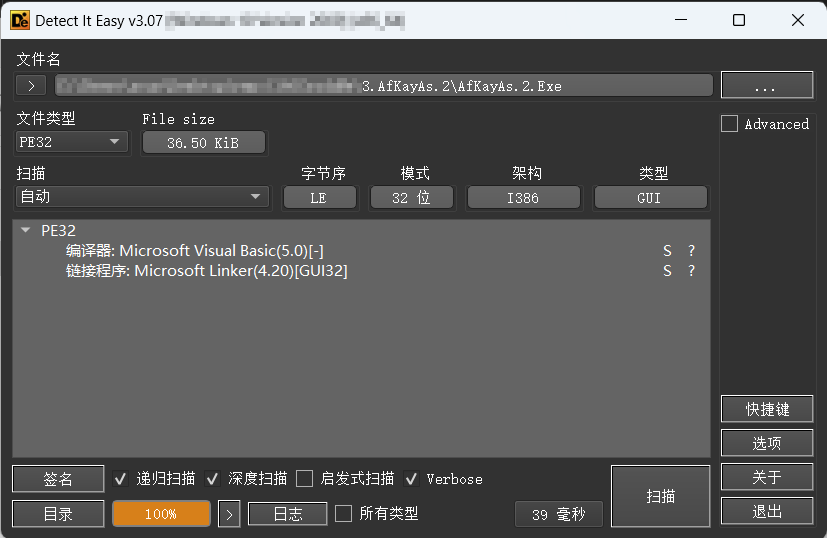
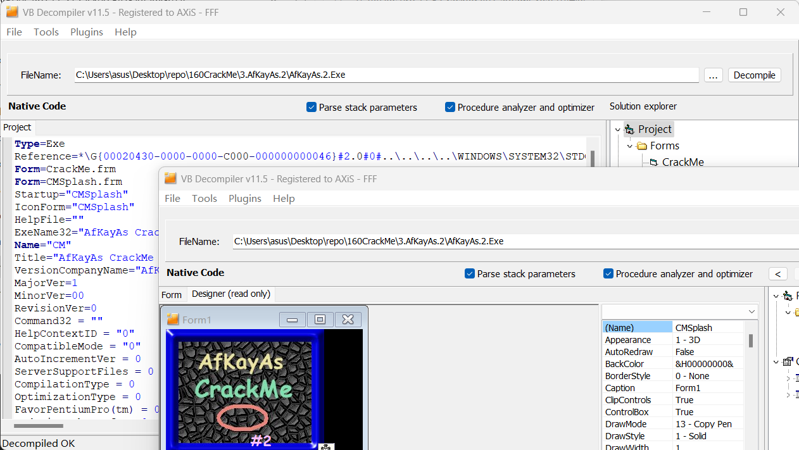
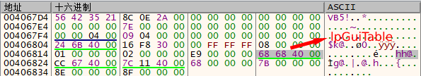
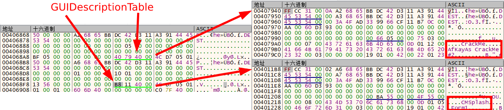
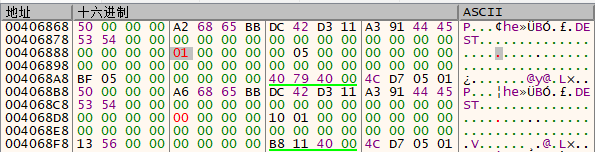

# 003 - AfKayAs.2

## 分析

  
先对 AfKayAs.2.Exe 进行查壳。  
可以看到这是一个用 VB 编写的程序，并且没有加壳，所以在 VB Decompiler 中打开（可能提示“This file may be packed”，无视）。

## 去掉 NAG 窗口

  
从 VB Decompiler 中可以看到 NAG 窗口实际上是 VB 的一个窗口，所以可以通过修改启动窗口来达到去除 NAG 窗口的效果。  
VB 程序的入口点总是这样的  

```asm
push <exe name>.40xxxx ; 这个地址存放着 VB_HEADER
call <JMP.&ThunRTMain>
```

在 x32dbg 中**右键**->**在内存窗口中转到**->**afkayas.2.004067D4** 可以看到 VB_HEADER 的具体信息。  
  
上图中的四个字节（偏移 0x4C，小端序）代表着 VB_HEADER 的 lpGuiTable，它是一个指向 VB_GUI_TABLE 的指针，VB_GUI_TABLE 这个结构中描述了窗口和控件的信息。  

选中这四个字节，**右键**->**在当前内存窗口中转到指定DWORD** 后可以看到两块相似的数据，这就是两个 VB_GUI_TABLE 结构体，前两个字节代表它们的大小（0x50）。  
  
从 GUIDescriptionTable[^1] 中可以看出第一个 VB_GUI_TABLE 代表着 CrackMe 窗口，第二个代表 CMSplash 窗口，这个程序会加载在 0x24 处为 01 的窗口，所以只需要把两个序号互换来绕过 NAG 窗口。  

## 注册分析

[^1]:目前仍然缺少对 VB 内部结构的详细描述，这个名字并不准确
