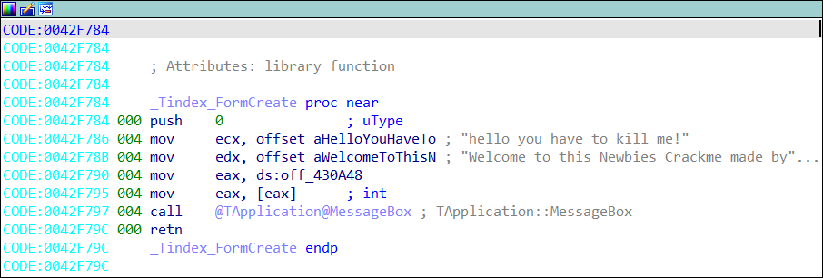

# CrackMe 001 - Acid burn

作为“适合破解新手的160个crackme练手”系列的第一个 CrackMe，难度很小，唯一的难点在于关键代码处函数调用的作用分析，然而这一点可以通过加载 IDA 的签名+[x64dbgida](https://github.com/x64dbg/x64dbgida#installation) 插件轻松解决。

## 分析


首先对 Acid burn.exe 检测。可以看到这是一个用 Delphi 3.x 写的无壳程序，所以可以直接用 Delphi Decompiler 来打开它。


在 Delphi Decompiler 中打开后查看 **Forms** 和 **Procedures** 选项卡，可以清晰的看到窗口对应的过程。

## 去除 NAG 弹窗


打开 Acid burn.exe 后可以看到一个 NAG 弹窗并且要求去除它，这个弹窗是在主窗口显示之前出现的，所以可以推断出主窗口应该会有一个窗口创建的事件来显示这个弹窗。


从图中可以看到，Tindex 是启动窗口，并且果不其然有个窗口创建的事件。转到 **Procedures**->**Unit2    Tindex**->**Events**后双击 **FormCreate** 事件后不难看出这里就是弹出弹窗的关键代码。

```asm
0042F784   6A00                   push    $00

* Possible String Reference to: 'hello you have to kill me!'
|
0042F786   B9A0F74200             mov     ecx, $0042F7A0

* Possible String Reference to: 'Welcome to this Newbies Crackme mad
|                                e by ACiD BuRN [CracKerWoRlD]'
|
0042F78B   BABCF74200             mov     edx, $0042F7BC

* Reference to TApplication instance
|
0042F790   A1480A4300             mov     eax, dword ptr [$00430A48]
0042F795   8B00                   mov     eax, [eax]

* Reference to: Forms.Proc_0042A170
|
0042F797   E8D4A9FFFF             call    0042A170
0042F79C   C3                     ret
```


在 IDA 中打开 Acid burn.exe 后点击 **View**->**Open subviews**->**Signatures** 右键并点击 **Apply new signature...**，并导入 delphi 和 d3vcl 两个签名。导入签名后可以看到 IDA 正确识别了函数。



在 **Procedures**->**Events** 中右击 **FormCreate** 后点击 **Copy current RVA to clipboard** 复制这个事件的 RVA 0042F784，并在 IDA 中按下 **G** 键（或者点击 **Jump**->**Jump to address...**）输入这个地址后可以转到这个事件的函数。


转到 **Options**->**General...**->**Disassembly**->**Display disassembly line parts** 中开启 **Line prefixes (graph)** 和 **Stack Pointer** 后可以看到，0042F784 和 0042F79C 的栈指针是相同的，所以选中 0042F784 并点击 **Edit**->**Patch program**->**Assemble...** 来修改汇编代码。


将 push 0 修改为 jmp 0x42F79C 并按下回车修改后点击 **Edit**->**Patch Program**->**Apply patches to...** 并点击 **Apply patches**将修改保存到文件即可跳过弹窗。


可以点击 **Edit**->**x64dbgida**->**Export x64dbg database** 来导出之前应用的签名来给接下来的 x64dbg 来使用，保存到 x64dbg 目录下的 **x32\db\Acid burn.exe.dd32** 文件即可（如果没有 x64dbgida 插件可以在此处[下载 Acid burn.exe.dd32 文件](misc/Acid burn.exe.dd32)）。

## Serial/Name 分析

## Name 分析

